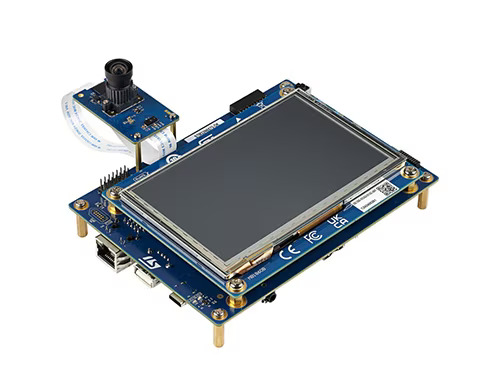
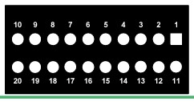
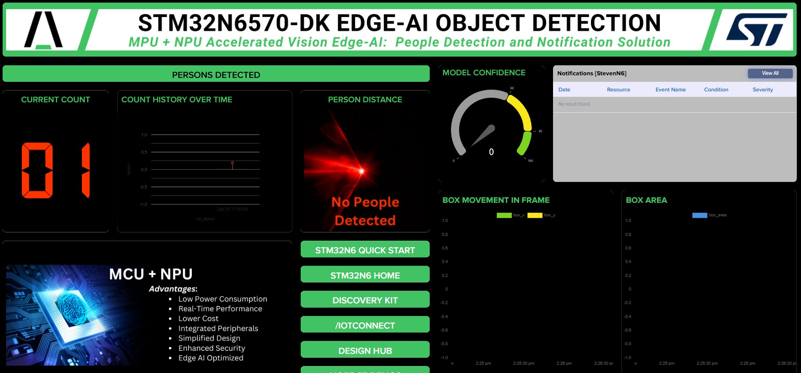

## STMicroelectronics STM32N6 QuickStart
1. [Introduction](#1-introduction)
2. [Prerequisites](#2-prerequisites)
3. [STM32N6 Hardware Setup](#3-stm32n6-hardware-setup)
4. [Programming the board](#4-programming-the-board)
5. [Cloud Account Setup](#5-cloud-account-setup)
6. [Create a Device Template in /IOTCONNECT](#6-create-a-device-template-in-iotconnect)
7. [Create a Device /IOTCONNECT](#7-create-a-device-iotconnect)
8. [Obtain /IOTCONNECT Connection Info](#8-obtain-iotconnect-connection-info)
9. [Flash/Configure the DA16k PMOD module](#9-flashconfigure-the-da16k-pmod-module)
10. [Run the Applicaton](#10-run-the-applicaton)
11. [Verify Data stream and Import a Dashboard](#11-verify-data-stream-and-import-a-dashboard)
12. [Demo Overview](#12-demo-overview)
* [Resources](#resources)
* [Revision Info](#revision-info)

## 1. Introduction
This document outlines the steps of setting up the [STM32N6570-DK](https://www.st.com/en/evaluation-tools/stm32n6570-dk.html) with Avnet's /IOTCONNECT platform.  The QuickStart demonstrates ST's edge AI computer vision model (based on the [n6-ai-h264-uvc](https://www.st.com/en/development-tools/stm32n6-ai.html#get-software) example) and 
provides object detection information to /IOTCONNECT for visualization. 
<table>
  <tr>
    <td></td>
    <td>The STM32N6 Discovery Kit is a development platform designed to help engineers and developers build and prototype applications using the STM32N6 microcontroller series. It features a high-performance MCU with enhanced connectivity options, making it ideal for a variety of IoT and industrial applications. The kit includes a range of peripherals, such as sensors, displays, and communication modules, to facilitate rapid development and testing. The /IOTCONNECT platform offers seamless integration with IoT devices, providing advanced capabilities for remote monitoring, management, and analytics. It enables users to streamline device connectivity and data collection, enhancing the efficiency and scalability of IoT projects.</td>
  </tr>
</table>

## 2. Prerequisites
This guide has been written and tested with the hardware and software listed below, but may work with other environments with some modifications.

### Hardware
* STM32N6570-DK Discovery Kit - [Purchase](https://www.avnet.com/shop/us/products/stmicroelectronics/stm32n6570-dk-3074457345660283716) | [Kit Manual](https://www.st.com/resource/en/user_manual/um3300-discovery-kit-with-stm32n657x0-mcu-stmicroelectronics.pdf) | [Device Specifications](https://www.st.com/resource/en/data_brief/stm32n6570-dk.pdf)
* PC with Windows 10/11
* 2x USB Type-C data cables
* 4x Male to Female header jumpers [Buy from Newark](https://www.newark.com/multicomp-pro/mp006283/jumper-wire-kit-male-to-female/dp/15AJ6557)
* /IOTCONNECT enabled PMOD such as the [DA16200](https://www.avnet.com/shop/us/products/renesas-electronics/us159-da16200mevz-3074457345649323747) or [DA16600](https://www.avnet.com/shop/us/products/renesas-electronics/us159-da16600evz-3074457345649323748).

### Software
* A serial terminal application such as [Tera Term](https://sourceforge.net/projects/tera-term/) (Recommended) or a browser-based version such as [Google Chrome Labs Serial Terminal](https://googlechromelabs.github.io/serial-terminal/)
* Download and Install the latest [STM32CubeProgrammer](https://www.st.com/en/development-tools/stm32cubeprog.html) (A free [MyST](https://my.st.com/cas/login) account is required to download)
* A multimedia player that supports the video stream from the N6 camera module. A player that has all the necessary codecs, and works out-of-the-box is [POT Player](https://potplayer.daum.net/). Other multimedia players may work as well.
* Download and unzip the one or more of the following packages that contain the bootloader, AI model and application binaries:
  * [uvc](https://downloads.iotconnect.io/partners/st/demos/n6/uvc.zip)  
  * [object-detection](https://downloads.iotconnect.io/partners/st/demos/n6/object-detection.zip)  
  * [image-classification](https://downloads.iotconnect.io/partners/st/demos/n6/image-classification.zip)  
  * [pose-estimation](https://downloads.iotconnect.io/partners/st/demos/n6/pose-estimation.zip)    
  * [multi-pose-estimation](https://downloads.iotconnect.io/partners/st/demos/n6/multi-pose-estimation.zip)  
  * [hand-landmarks](https://downloads.iotconnect.io/partners/st/demos/n6/hand-landmarks.zip)  
  * [instance-segmentation](https://downloads.iotconnect.io/partners/st/demos/n6/instance-segmentation.zip)  
  * [semantic-segmentation](https://downloads.iotconnect.io/partners/st/demos/n6/semantic-segmentation.zip)

## 3. STM32N6 Hardware Setup
<details>
  <summary>Board Components Reference</summary>
  
</details>

* Connect the camera via the white ribbon cable to the board (the blue stripe should be facing up on both ends).
* Change the Power Input Select Header (JMP2) from the 1-2 position to the 3-4 position to allow power delivery from both USB-C ports.
* Connect two USB type-C cables from each side of the board to the PC.
* Move the **BOOT1** switch to the right position to enter the "Development Boot" mode.
* Press the **RESET** button.

## 4. Programming the board

### 4.1 Setup the Programmer
* Ensure that boot pins are in DEV_BOOT mode. (BOOT1 switch to the RIGHT position and BOOT0 switch to the LEFT)
* Launch the **STM32CubeProgrammer**.
* In the left menu, click the `External loaders` ("EL" icon).
* Use the search box to find `STM32N6570-DK` and select the check box to the left.
* In the upper right corner, change the "connection type" to `ST-LINK`.
* Just below, change the ST-LINK configuration "mode" to `Hot Plug`
* Click `Connect`

### 4.2 Program the Binaries
* In the left menu, click the `Erasing & programming` to program the (3) binaries.
#### 4.2.1 Program Bootloader
The **Bootloader** initializes the hardware, validates the firmware the enforces secure boot.
* Click `Browse` and navigate to and select `ai_fsbl.hex` previously extracted.
* Click `Start Programming` and wait until complete.
#### 4.2.2 Program the AI Model
The **AI Model** contains optimized model data for Neural-ART accelerator.
* Click `Browse` and navigate to and select `network_data.hex` previously extracted.
* Click `Start Programming` and wait until complete.
#### 4.2.3 Program the Application
The **Application** implements the core functionalities of the demo such as the AI inference and camera processing.
* Click `Browse` and navigate to and select `xxxxxxxx_sign.bin` associated with the model of interest that was previously extracted.
* In the `Start Address` field, enter the following address:
```
0x70100000
```
* Click `Start Programming` and wait until complete.
* When programming has completed, move the **BOOT1** switch back to the **LEFT** position to boot from the External Flash just programmed.
* **Disconnect** and **Close** the programmer.
* Press the **RESET** button.

#### 4.2.4 Optional: Erase the Board before Programming
* On STM32CubeProgrammer, after connecting the board, go to tab “Erasing and Programming”, then “Erase external memory” section. Select sectors 0 to 10 from start address 0x70000000 and click on "Erase selected sectors".
* Then programming 4.2.1, 4.2.2 and 4.2.3.

## 5. Cloud Account Setup
An /IOTCONNECT account with AWS backend is required.  If you need to create an account, a free trial subscription is available and no credit card is required.

[/IOTCONNECT Free Trial (AWS Version)](https://subscription.iotconnect.io/subscribe?cloud=aws)

> [!NOTE]
> Be sure to check your SPAM folder for the temporary password after registering if you don't see it after a couple minutes.

See the /IOTCONNECT [Subscription Information](https://github.com/avnet-iotconnect/avnet-iotconnect.github.io/blob/main/documentation/iotconnect/subscription/subscription.md) for more details on the trial including message limits.

## 6. Create a Device Template in /IOTCONNECT
A Device Template defines the characteristics of a piece of hardware including the telemetry the platform should expect to receive and any support commands.
* Download the premade device template [stm32n6_vision_device_template.json](../Projects/stm32n6_vision_device_template.json?raw=1) (**MUST** Right-Click and "Save-As" to get the raw json file)
* Log-in the [console.iotconnect.io](https://console.iotconnect.io/login) using the credentials received when registering. 
* Import a template into your /IOTCONNECT instance. `Devices -> Overview -> Import Template` or (Refer to [Importing a Device Template Guide](https://github.com/avnet-iotconnect/avnet-iotconnect.github.io/blob/main/documentation/iotconnect/import_device_template.md) and [/IOTCONNECT Documentation](https://docs.iotconnect.io/iotconnect/).)

## 7. Create a Device /IOTCONNECT
1. Click the `Device` icon and the "Device" sub-menu
2. At the top-right, click on the `Create Device` button
3. Enter `MySTN6` for both **Unique ID** and **Device Name**
4. Select the entity in the drop-down (if this is a new/trial account, there is only one option)
5. Select the template `n6uvc` from the template dropdown box
6. Leave the Device Certificate as "Auto-generated"
7. Click `Save & View`
8. `Downloading device certificate/key`: Click the link for `Connection Info` and then the icon in the top-right and save the file "MySTN6-certificates.zip" into your working directory. These certificates will be written to the PMOD in a subsequent section.

## 8. Obtain /IOTCONNECT Connection Info
* The Company ID (`CPID`) and Environment (`ENV`) variables identifying your unique /IOTCONNECT account will be used to instruct the PMOD how to connect to the platform. This information is located in the `Settings` -> `Key Vault` section of the platform.
* Save these two values for use in the next section.
  
## 9. Flash/Configure the DA16k PMOD module
Follow the instructions in the [DA16K QuickStart Guide](https://github.com/avnet-iotconnect/iotc-dialog-da16k-sdk/blob/main/doc/QUICKSTART.md) to flash the DA16k PMOD then return to this guide.  This guide will walk through flashing the PMOD and entering the /IOTCONNECT connection information and device certificates.


## 10. Run the Applicaton
* Power off the board by unplugging the USB cables.
* Connect the DA16k PMOD module to the board's STMod+ Connector via the male-to-female jumper wires. (See the [STMod+ Technical note](https://www.st.com/resource/en/technical_note/tn1238-stmod-interface-specification-stmicroelectronics.pdf) and the [Digilent Pmod™ Interface Specification](https://digilent.com/reference/_media/reference/pmod/pmod-interface-specification-1_2_0.pdf) for more information on pinouts).

| PMOD pin # | STMOD+ pin # |             
|:----------:|:------------:| 
|   2 (RX)   | 2 (UARTy_TX) | 
|   3 (TX)   | 3 (UARTy_RX) | 
|  5 (GND)   |   16 (GND)   |
|  6 (+5v)   |   6 (+5v)    |

<details>
  <summary>STMod+ Header Reference</summary>
  
</details>

* Reconnect the USB cables to the board.
* Launch the camera application (e.g. [POT Player](https://potplayer.daum.net/)) on the PC to begin streaming the video.
* If using the POT player, click `Open` then select `Open Webcam\Other Device`.

> [!NOTE]
> The video stream needs to be playing for the inferencing to be enabled.

The multimedia player should now be displaying bounding boxes around any object detected in the field of view of the camera module.

## 11. Verify Data stream and Import a Dashboard

* Switch back to the /IOTCONNECT browser window and verify the device status is displaying as `Connected`
* Download the associated Dashboard Template from the `Projects` folder here: [Projects](../Projects)
* **Download** the template then select `Create Dashboard` from the top of the page
* **Select** the `Import Dashboard` option and select `n6uvc` for **template** and `MySTN6` for **device** 
* **Enter** a name (such as `MyN6 Demo Dashboard`) and complete the import

You will now be in the dashboard edit mode. You can add/remove widgets or just click `Save` in the upper-right corner to exit the edit mode.
## 12. Demo Overview
* As people are detected in the field of view of the camera module, the current count will be displayed on the left side.
* The "Person Distance" will use to the ratio of the bounding boxes to the overall image size to approximate the distance (this is not calibrated and just shown as a proof of concept).
* The Model Confidence is displayed as a gauge chart in the middle of the screen.

<details>
  <summary>Demo Dashboard</summary>
  
</details>

## Resources
* [Vision AI Webinar Slides](https://downloads.iotconnect.io/partners/st/demos/uvc/docs/Avnet%20Webinar%20-%20Vision-based%20Edge%20AI%20PoCs%20leveraging%20the%20STM32N6%20MCU.pdf)
* [Level 200 Webinar Slides](https://github.com/avnet-iotconnect/iotc-stm32-n6-demos/blob/main/doc/Avnet%20Webinar%20-%20N6%20200.pdf)
* [Purchase the STM32N6570-DK](https://www.avnet.com/shop/us/products/stmicroelectronics/stm32n6570-dk-3074457345660283716)
* [STM32N6570-DK Product Overview](https://www.st.com/en/evaluation-tools/stm32n6570-dk.html)
* [Other /IOTCONNECT enabled ST Devices](https://www.avnet.com/iotconnect/st)
* [/IOTCONNECT Overview](https://www.iotconnect.io/)
* [/IOTCONNECT Knowledgebase](https://help.iotconnect.io/)
* [Reference Design Library on Avnet Design Hub](https://www.avnet.com/wps/portal/us/solutions/product-and-solutions-design/design-hub/design-results?dhsearch=STM32N6)

## Revision Info

- View change to this repository: [Commit History](https://github.com/avnet-iotconnect/iotc-stm32-n6-demos/commits/main)
- View changes to this document: [QUICKSTART.md](https://github.com/avnet-iotconnect/iotc-stm32-n6-demos/commits/main/doc/QUICKSTART.md)
